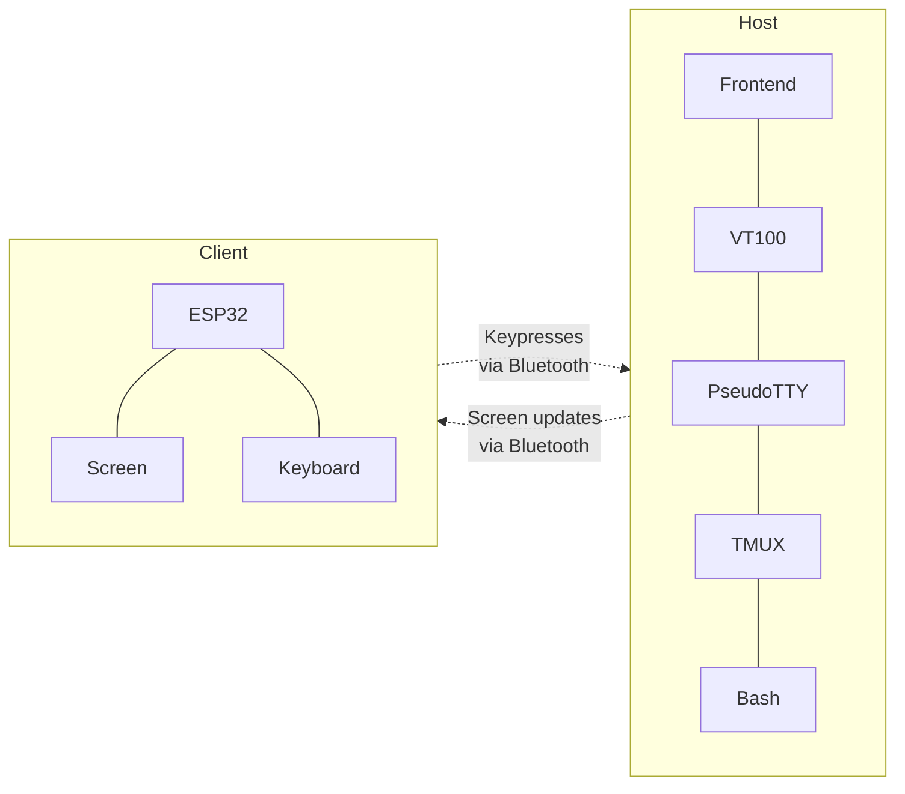

## Design

Client module example

```rust
mod client;

let mut client = client::ClientBuilder::new()
    .size(10, 40)
    .cmd("tmux")
    .arg("new-session")
    .arg("-A")
    .arg("-s")
    .arg("client-name")
    .build();
client.process_ms(1000);
client.send_str("date -Is\r");
client.to_stdout(); # should print the current date
client.kill();
client.wait();
```



Bluetooth LE architecture

Attributes

 - Service Terminal
   - Characteristic Screen
      - Access: Writable
      - Encryption: Authenticated encryption required
      - Authorization: Yes
      - Value: (max 512 bytes)
      - rows, cols, per cell attribute?
      - or push square updates
   - Characteristic Keyboard

23 bytes MTU to fit one ATT in one LL packet.
One ATT packet can span multiple LL packets,
up to (practically) size 512 (the maximum attribute size).

Bluetooth 4.2 introduces the LE Data Packet Length Extension.

ESP32 Bluetooth:
 - Bluetooth v4.2 BR/EDR and Bluetooth LE specification compliant
 - BLE with Data Length Extension and Link Layer Encryption


For serial ordering and no GATT caching
```
# /etc/bluetooth/main.conf
[GATT]
Cache = no
Channels = 1
```
